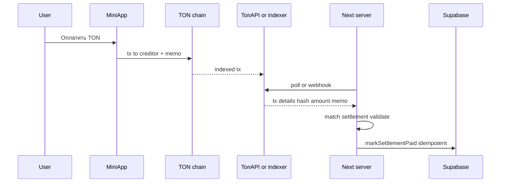

# План интеграции переводов TON

## Цель

Добавить группы в валюте **TON** (нанотоны) с ончейн-подтверждением и **автоматическим закрытием settlement** при валидной транзакции. Группы в **RUB** и их UX (ручное «Оплатил») остаются как сейчас, без изменения логики.

**Статус:** план к реализации; код может отставать от этого документа до мержа фичи.

## Принцип: две параллельные модели

| Валюта группы | Учёт сумм | Закрытие settlement |
|---------------|-----------|----------------------|
| **RUB** (как сейчас) | `amount_minor` = копейки | Только вручную: кнопка «Оплатил» → `markSettlementPaid` — **без изменений** |
| **TON** | `amount_minor` = нанотоны | Пользователь отправляет tx с **обязательным memo/payload**; бэкенд **подтверждает транзакцию** в сети и **автоматически** переводит settlement в `paid` |

Смешивать валюты в одной группе **нельзя** (одна группа — либо RUB, либо TON). Новые TON-группы добавляются к существующим RUB-группам.

## Текущее состояние (релевантное)

- Сейчас везде **RUB** и копейки; см. [[database-schema-mvp-final]], `lib/groups/resolve-group-settlements-display.ts`, `components/groups/mark-paid-button.tsx`.
- Для **RUB** после реализации TON: те же экраны, те же server actions, те же права (организатор / должник).

## 1. Денежная модель для TON

- Хранение: целые **нанотоны** в существующих `amount_minor` / `bigint` (семантика зависит от `groups.currency`).
- `groups.currency`: `'RUB' | 'TON'` (миграция check).
- Форматирование и лимиты: отдельные хелперы для TON vs RUB в `lib/money.ts`; валидации в `lib/validation/expenses.ts` — ветвление по валюте группы.

## 2. Адреса и отправка

- У **кредитора** (получателя перевода по строке settlement) должен быть известен **TON friendly address** (хранение на `users` и/или `group_members` — уточнить при реализации).
- Кнопка **«Оплатить TON»** (только для `currency === "TON"` и если пользователь может платить по этой строке): перевод на адрес кредитора, сумма = `amount_minor` нанотонов, **memo/comment** кодирует однозначную связь с settlement (например UUID settlement или короткий `payment_id` из БД).

Без корректного memo автоматическая верификация ненадёжна (несколько платежей, спам).

## 3. Подтверждение транзакции и автозакрытие (обязательный scope)

Цель: после появления в сети **подтверждённой** транзакции, удовлетворяющей правилам, вызвать ту же бизнес-логику, что и ручной «Оплатил» — **без участия пользователя** на втором шаге.

- **Источник правды:** публичный API (например **TonAPI** с ключом в env) или аналог; запрос по хэшу (если клиент вернул hash после отправки) или **периодический опрос** по адресу кредитора + фильтр по memo и сумме.
- **Правила матчинга (минимум):** совпадение **получателя**, **суммы** (нанотоны), **memo** с ожидаемым идентификатором, статус settlement = `suggested`, сеть mainnet/testnet согласована с env.
- **Идемпотентность:** одна tx — одно закрытие; повторные проверки не должны дублировать side effects. Хранить `ton_tx_hash` (или аналог) на `settlements` после успеха.
- **Защита:** не полагаться только на сумму без уникального memo; обрабатывать гонки (два воркера).

Ручная кнопка «Оплатил» для **TON** может быть **скрыта** или оставлена только организатору как fallback (продуктовое решение при реализации); для **RUB** кнопка остаётся как сейчас.

## 4. Затрагиваемые области кода

- Миграции, `lib/supabase/types.ts`
- Создание группы: выбор валюты RUB / TON
- `lib/groups/resolve-group-settlements-display.ts`: для RUB — текущая ветка; для TON — без изменения математики, но возможно отключение upsert при других правилах — проверить по коду
- Новый модуль: **верификация TON** (server-only), вызываемый из **cron** (Vercel Cron) или **route handler** по расписанию + опционально из клиента «проверить сейчас» после оплаты (ускорение UX)
- Повторное использование `lib/queries/settlements.ts` (`markSettlementPaid`) / server action после верификации
- UI `components/groups/active-settlements-list.tsx`: для TON — «Оплатить TON» + статус «ожидаем подтверждение» / «подтверждено»; для RUB — без изменений

## 5. Env и секреты

- `TONAPI_KEY` или эквивалент (если требуется провайдером)
- Явно задать **сеть** (`mainnet` / `testnet`) одной переменной

## 6. Риски

- Задержки сети и индексера — UX: показывать pending до подтверждения.
- Ошибочный memo / неверная сумма — tx не матчится; нужен support path (организатор / ручной fallback).
- Лимиты rate API — кэширование и аккуратный poll.

## Исключено из этого плана

- Конвертация RUB ↔ TON в одной группе.
- Изменение существующего **RUB**-флоу без отдельного запроса.

## Чеклист реализации

1. Миграция `groups.currency` (`'RUB' | 'TON'`); семантика `amount_minor` — копейки vs нанотоны; типы и проверки.
2. `lib/money.ts` и валидации — форматирование TON, лимиты для нанотонов; RUB-ветки форм без регрессий.
3. `resolveGroupSettlementsDisplay` — RUB как сейчас; TON — та же математика, отдельные ветки UI/флагов.
4. Хранение TON friendly-адреса получателя (`users` или `group_members`) + UI привязки для TON-групп.
5. Кнопка «Оплатить TON» — перевод с memo/payload (settlementId / `payment_id`) через TON Connect или deep link.
6. Подтверждение tx — TonAPI/Ton Center (или webhook), матчинг суммы, адреса, payload; идемпотентность.
7. При успешной верификации — `markSettlementPaid` + revalidate; путь RUB не трогать.
8. При необходимости — поля `settlements` (`ton_tx_hash`, `verified_at`) или таблица `ton_payment_intents` для дедупликации и аудита.
9. Обновить [[technical/money-formatting-policy]], [[database-schema-mvp-final]] (или отдельная миграция-док), и при необходимости вынести детали верификации в отдельный документ.

## Related

- [[technical/money-formatting-policy]]
- [[technical/settlement-algorithm-spec]]
- [[technical/telegram-miniapp-integration]]
